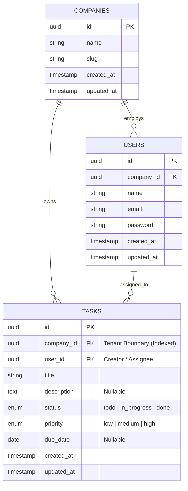

# Multi-Tenant Task Tracker — Technical Assessment Specification

> **Stack**: Laravel + Inertia.js + React + TypeScript + Tailwind CSS + Pest PHP  
> **Architecture**: Modular Monolith (Single repository, full-stack typed contracts)  
> **Core Focus**: Strict Company-Level Tenant Isolation, Clean Architecture, and Line-by-Line Explainability

---

## 1. Assessment Overview & Objectives

This project is a focused, production-grade **Task Tracker** module built to satisfy the hiring technical assessment requirements:
1. **Full CRUD Operations**: Create, Read, Update, Delete tasks.
2. **Company-Level Tenancy**: Strict data isolation ensuring users cannot view, query, mutate, or leak tasks belonging to other companies.
3. **Inertia.js Monolithic Flow**: Server-driven state delivering typed props directly to React components without detached REST/CORS boilerplate.
4. **Defensive Authorization**: 3-layer tenancy enforcement (Model Scopes, Route Policies, Form Request validation).
5. **Automated Testing**: Comprehensive Pest PHP test suite proving tenant boundaries and validation safety.
6. **Clean Git History**: Structured, incremental commits showing deliberate architectural steps.

---

## 2. Monolithic Architecture & Directory Structure

Everything lives in **one unified repository**. Laravel handles routing, authentication, multi-tenancy, and data persistence; Inertia bridges backend responses to TypeScript React pages inside `resources/js/`.

```
task-tracker/
├── app/
│   ├── Http/
│   │   ├── Controllers/
│   │   │   └── TaskController.php          # Full CRUD handling via Inertia responses
│   │   ├── Middleware/
│   │   │   └── HandleInertiaRequests.php   # Shares authenticated user & company to React
│   │   └── Requests/
│   │       ├── StoreTaskRequest.php        # Validation rules & tenant ID injection
│   │       └── UpdateTaskRequest.php        # Validation rules & tenant-safe updates
│   ├── Models/
│   │   ├── Company.php                     # Tenant model
│   │   ├── User.php                        # BelongsTo Company
│   │   └── Task.php                        # BelongsTo Company & User (with scopes)
│   └── Policies/
│       └── TaskPolicy.php                  # Strict tenant boundary authorization checks
├── database/
│   ├── factories/
│   │   ├── CompanyFactory.php              # Factory for tenant testing
│   │   ├── UserFactory.php                 # Factory for users
│   │   └── TaskFactory.php                 # Factory for tasks
│   ├── migrations/
│   │   ├── 2024_01_01_000001_create_companies_table.php
│   │   ├── 2024_01_01_000002_create_users_table.php
│   │   └── 2024_01_01_000003_create_tasks_table.php
│   └── seeders/
│       └── DatabaseSeeder.php              # Seeds Demo Company A & B for live testing
├── resources/
│   └── js/
│       ├── Components/
│       │   ├── DangerButton.tsx
│       │   ├── PrimaryButton.tsx
│       │   ├── PriorityBadge.tsx           # Visual indicator for Low / Medium / High
│       │   ├── StatusBadge.tsx             # Visual indicator for Todo / In Progress / Done
│       │   ├── TaskForm.tsx                # Reusable form component using Inertia useForm
│       │   └── TextInput.tsx
│       ├── Layouts/
│       │   └── AuthenticatedLayout.tsx     # Shell showing tenant company badge & user info
│       ├── Pages/
│       │   └── Tasks/
│       │       ├── Index.tsx               # Task list with filters & company stats
│       │       ├── Create.tsx              # Create task view
│       │       ├── Edit.tsx                # Edit task view
│       │       └── Show.tsx                # Task detail view with audit timestamps
│       └── types/
│           └── index.d.ts                  # Shared TypeScript interfaces (Task, User, Company)
├── routes/
│   ├── web.php                             # Inertia task resource routes (auth-protected)
│   └── auth.php                            # Standard authentication routes
├── tests/
│   └── Feature/
│       ├── TaskCrudTest.php                # Pest tests for complete CRUD lifecycle
│       └── TaskTenancyTest.php             # Pest tests proving cross-tenant isolation
├── composer.json                           # Backend dependencies (Laravel, Inertia, Pest)
├── package.json                            # Frontend dependencies (React, Inertia, TypeScript, Tailwind)
└── README.md                               # Setup guide, architectural reasoning, and AI usage notes
```

---

## 3. Database Schema Design

### 3.1 ERD & Relational Model



### 3.2 Migrations Detail

```php
// database/migrations/2024_01_01_000003_create_tasks_table.php
Schema::create('tasks', function (Blueprint $table) {
    $table->uuid('id')->primary();
    $table->foreignUuid('company_id')->constrained()->cascadeOnDelete()->index();
    $table->foreignUuid('user_id')->constrained()->cascadeOnDelete();
    $table->string('title', 200);
    $table->text('description')->nullable();
    $table->enum('status', ['todo', 'in_progress', 'done'])->default('todo')->index();
    $table->enum('priority', ['low', 'medium', 'high'])->default('medium');
    $table->date('due_date')->nullable();
    $table->timestamps();

    // Composite index for fast tenant-scoped listing & filtering
    $table->index(['company_id', 'status', 'created_at']);
});
```

---

## 4. Multi-Tenancy: 3-Layer Defense Architecture

A query that forgets to filter by `company_id` is a critical security vulnerability. This system enforces data isolation across three distinct layers:

```
                  Incoming Request (GET /tasks/123)
                                 │
                                 ▼
┌─────────────────────────────────────────────────────────────────┐
│ Layer 1: Controller Query Scoping                               │
│ Query is strictly bound to Auth User's company_id               │
│ Task::forCompany(auth()->user()->company_id)->findOrFail($id)   │
└────────────────────────────────┬────────────────────────────────┘
                                 │
                                 ▼
┌─────────────────────────────────────────────────────────────────┐
│ Layer 2: Laravel Route Model Policy Check                       │
│ $this->authorize('view', $task)                                 │
│ Checks: return $user->company_id === $task->company_id          │
└────────────────────────────────┬────────────────────────────────┘
                                 │
                                 ▼
┌─────────────────────────────────────────────────────────────────┐
│ Layer 3: Form Request Input Validation & Auto-Injection         │
│ StoreTaskRequest automatically injects company_id from session   │
│ Ensures payload cannot forge a foreign company_id               │
└─────────────────────────────────────────────────────────────────┘
```

### 4.1 Layer 1: Model Scopes & Relationships (`app/Models/Task.php`)

```php
namespace App\Models;

use Illuminate\Database\Eloquent\Concerns\HasUuids;
use Illuminate\Database\Eloquent\Factories\HasFactory;
use Illuminate\Database\Eloquent\Model;
use Illuminate\Database\Eloquent\Relations\BelongsTo;
use Illuminate\Database\Eloquent\Builder;

class Task extends Model
{
    use HasFactory, HasUuids;

    protected $fillable = [
        'company_id',
        'user_id',
        'title',
        'description',
        'status',
        'priority',
        'due_date',
    ];

    protected $casts = [
        'due_date' => 'date',
    ];

    public function company(): BelongsTo
    {
        return $this->belongsTo(Company::class);
    }

    public function user(): BelongsTo
    {
        return $this->belongsTo(User::class);
    }

    /**
     * Scope query to only include tasks for a given company.
     */
    public function scopeForCompany(Builder $query, string $companyId): Builder
    {
        return $query->where('company_id', $companyId);
    }
}
```

### 4.2 Layer 2: Authorization Policy (`app/Policies/TaskPolicy.php`)

```php
namespace App\Policies;

use App\Models\Task;
use App\Models\User;

class TaskPolicy
{
    public function viewAny(User $user): bool
    {
        return true; // Filtered at query level via forCompany()
    }

    public function view(User $user, Task $task): bool
    {
        return $user->company_id === $task->company_id;
    }

    public function create(User $user): bool
    {
        return !is_null($user->company_id);
    }

    public function update(User $user, Task $task): bool
    {
        return $user->company_id === $task->company_id;
    }

    public function delete(User $user, Task $task): bool
    {
        return $user->company_id === $task->company_id;
    }
}
```

### 4.3 Layer 3: Form Request Sanitization (`app/Http/Requests/StoreTaskRequest.php`)

```php
namespace App\Http\Requests;

use Illuminate\Foundation\Http\FormRequest;
use Illuminate\Validation\Rule;

class StoreTaskRequest extends FormRequest
{
    public function authorize(): bool
    {
        return !is_null($this->user()->company_id);
    }

    public function rules(): array
    {
        return [
            'title' => ['required', 'string', 'max:200'],
            'description' => ['nullable', 'string', 'max:2000'],
            'status' => ['required', Rule::in(['todo', 'in_progress', 'done'])],
            'priority' => ['required', Rule::in(['low', 'medium', 'high'])],
            'due_date' => ['nullable', 'date', 'after_or_equal:today'],
        ];
    }

    /**
     * Provide sanitized data guaranteed to be bound to the user's company.
     */
    public function tenantData(): array
    {
        return array_merge($this->validated(), [
            'company_id' => $this->user()->company_id,
            'user_id' => $this->user()->id,
        ]);
    }
}
```

---

## 5. Controller Implementation (`app/Http/Controllers/TaskController.php`)

```php
namespace App\Http\Controllers;

use App\Http\Requests\StoreTaskRequest;
use App\Http\Requests\UpdateTaskRequest;
use App\Models\Task;
use Illuminate\Http\RedirectResponse;
use Illuminate\Http\Request;
use Inertia\Inertia;
use Inertia\Response;

class TaskController extends Controller
{
    public function __construct()
    {
        $this->authorizeResource(Task::class, 'task');
    }

    public function index(Request $request): Response
    {
        $tasks = Task::forCompany($request->user()->company_id)
            ->with('user:id,name,email')
            ->when($request->status, fn($q, $status) => $q->where('status', $status))
            ->when($request->priority, fn($q, $priority) => $q->where('priority', $priority))
            ->latest()
            ->paginate(10)
            ->withQueryString();

        return Inertia::render('Tasks/Index', [
            'tasks' => $tasks,
            'filters' => $request->only(['status', 'priority']),
            'company' => $request->user()->company->only(['id', 'name']),
        ]);
    }

    public function create(): Response
    {
        return Inertia::render('Tasks/Create');
    }

    public function store(StoreTaskRequest $request): RedirectResponse
    {
        Task::create($request->tenantData());

        return redirect()->route('tasks.index')
            ->with('success', 'Task created successfully.');
    }

    public function show(Task $task): Response
    {
        $task->load('user:id,name,email');

        return Inertia::render('Tasks/Show', [
            'task' => $task,
        ]);
    }

    public function edit(Task $task): Response
    {
        return Inertia::render('Tasks/Edit', [
            'task' => $task,
        ]);
    }

    public function update(UpdateTaskRequest $request, Task $task): RedirectResponse
    {
        $task->update($request->validated());

        return redirect()->route('tasks.index')
            ->with('success', 'Task updated successfully.');
    }

    public function destroy(Task $task): RedirectResponse
    {
        $task->delete();

        return redirect()->route('tasks.index')
            ->with('success', 'Task deleted successfully.');
    }
}
```

---

## 6. Frontend: Typed Contracts & Inertia React UI

### 6.1 Shared TypeScript Definitions (`resources/js/types/index.d.ts`)

```typescript
export interface Company {
    id: string;
    name: string;
    slug: string;
    created_at: string;
}

export interface User {
    id: string;
    company_id: string;
    name: string;
    email: string;
    company?: Company;
}

export type TaskStatus = 'todo' | 'in_progress' | 'done';
export type TaskPriority = 'low' | 'medium' | 'high';

export interface Task {
    id: string;
    company_id: string;
    user_id: string;
    title: string;
    description: string | null;
    status: TaskStatus;
    priority: TaskPriority;
    due_date: string | null;
    created_at: string;
    updated_at: string;
    user?: Pick<User, 'id' | 'name' | 'email'>;
}

export interface PaginatedData<T> {
    data: T[];
    current_page: number;
    last_page: number;
    per_page: number;
    total: number;
    links: Array<{
        url: string | null;
        label: string;
        active: boolean;
    }>;
}

export interface PageProps {
    auth: {
        user: User;
    };
    flash: {
        success?: string;
        error?: string;
    };
}
```

### 6.2 Task List View (`resources/js/Pages/Tasks/Index.tsx`)

```tsx
import React from 'react';
import { Head, Link, router } from '@inertiajs/react';
import AuthenticatedLayout from '@/Layouts/AuthenticatedLayout';
import { Task, PaginatedData, TaskStatus, TaskPriority } from '@/types';
import StatusBadge from '@/Components/StatusBadge';
import PriorityBadge from '@/Components/PriorityBadge';
import PrimaryButton from '@/Components/PrimaryButton';

interface Props {
    tasks: PaginatedData<Task>;
    filters: {
        status?: TaskStatus;
        priority?: TaskPriority;
    };
    company: {
        id: string;
        name: string;
    };
}

export default function Index({ tasks, filters, company }: Props) {
    const handleFilterChange = (key: string, value: string) => {
        router.get(
            route('tasks.index'),
            { ...filters, [key]: value || undefined },
            { preserveState: true, replace: true }
        );
    };

    return (
        <AuthenticatedLayout
            header={
                <div className="flex justify-between items-center">
                    <div>
                        <h2 className="text-xl font-semibold leading-tight text-gray-800">
                            Task Management
                        </h2>
                        <p className="text-xs text-gray-500 mt-1">
                            Tenant Workspace: <span className="font-semibold text-indigo-600">{company.name}</span>
                        </p>
                    </div>
                    <Link href={route('tasks.create')}>
                        <PrimaryButton>+ New Task</PrimaryButton>
                    </Link>
                </div>
            }
        >
            <Head title="Tasks" />

            <div className="py-8 max-w-7xl mx-auto px-4 sm:px-6 lg:px-8">
                {/* Filter Controls */}
                <div className="mb-6 flex gap-4 bg-white p-4 rounded-lg shadow-sm border border-gray-100">
                    <div>
                        <label className="block text-xs font-medium text-gray-600 mb-1">Status</label>
                        <select
                            value={filters.status || ''}
                            onChange={(e) => handleFilterChange('status', e.target.value)}
                            className="rounded-md border-gray-300 text-sm focus:border-indigo-500 focus:ring-indigo-500"
                        >
                            <option value="">All Statuses</option>
                            <option value="todo">To Do</option>
                            <option value="in_progress">In Progress</option>
                            <option value="done">Done</option>
                        </select>
                    </div>
                    <div>
                        <label className="block text-xs font-medium text-gray-600 mb-1">Priority</label>
                        <select
                            value={filters.priority || ''}
                            onChange={(e) => handleFilterChange('priority', e.target.value)}
                            className="rounded-md border-gray-300 text-sm focus:border-indigo-500 focus:ring-indigo-500"
                        >
                            <option value="">All Priorities</option>
                            <option value="low">Low</option>
                            <option value="medium">Medium</option>
                            <option value="high">High</option>
                        </select>
                    </div>
                </div>

                {/* Table */}
                <div className="bg-white overflow-hidden shadow-sm sm:rounded-lg border border-gray-100">
                    <table className="min-w-full divide-y divide-gray-200">
                        <thead className="bg-gray-50">
                            <tr>
                                <th className="px-6 py-3 text-left text-xs font-medium text-gray-500 uppercase">Title</th>
                                <th className="px-6 py-3 text-left text-xs font-medium text-gray-500 uppercase">Status</th>
                                <th className="px-6 py-3 text-left text-xs font-medium text-gray-500 uppercase">Priority</th>
                                <th className="px-6 py-3 text-left text-xs font-medium text-gray-500 uppercase">Due Date</th>
                                <th className="px-6 py-3 text-left text-xs font-medium text-gray-500 uppercase">Assignee</th>
                                <th className="px-6 py-3 text-right text-xs font-medium text-gray-500 uppercase">Actions</th>
                            </tr>
                        </thead>
                        <tbody className="bg-white divide-y divide-gray-200">
                            {tasks.data.length === 0 ? (
                                <tr>
                                    <td colSpan={6} className="px-6 py-12 text-center text-sm text-gray-500">
                                        No tasks found for {company.name}. Create one to get started!
                                    </td>
                                </tr>
                            ) : (
                                tasks.data.map((task) => (
                                    <tr key={task.id} className="hover:bg-gray-50">
                                        <td className="px-6 py-4">
                                            <Link href={route('tasks.show', task.id)} className="font-medium text-indigo-600 hover:text-indigo-900">
                                                {task.title}
                                            </Link>
                                        </td>
                                        <td className="px-6 py-4"><StatusBadge status={task.status} /></td>
                                        <td className="px-6 py-4"><PriorityBadge priority={task.priority} /></td>
                                        <td className="px-6 py-4 text-sm text-gray-500">{task.due_date || 'No due date'}</td>
                                        <td className="px-6 py-4 text-sm text-gray-500">{task.user?.name}</td>
                                        <td className="px-6 py-4 text-right text-sm font-medium space-x-2">
                                            <Link href={route('tasks.edit', task.id)} className="text-gray-600 hover:text-gray-900">Edit</Link>
                                            <Link
                                                href={route('tasks.destroy', task.id)}
                                                method="delete"
                                                as="button"
                                                className="text-red-600 hover:text-red-900"
                                            >
                                                Delete
                                            </Link>
                                        </td>
                                    </tr>
                                ))
                            )}
                        </tbody>
                    </table>
                </div>
            </div>
        </AuthenticatedLayout>
    );
}
```

---

## 7. Automated Testing Suite (Pest PHP)

### 7.1 Multi-Tenancy Isolation Tests (`tests/Feature/TaskTenancyTest.php`)

```php
use App\Models\Company;
use App\Models\Task;
use App\Models\User;
use function Pest\Laravel\actingAs;

beforeEach(function () {
    $this->companyA = Company::factory()->create(['name' => 'Acme Corp']);
    $this->companyB = Company::factory()->create(['name' => 'Globex Inc']);

    $this->userA = User::factory()->for($this->companyA)->create();
    $this->userB = User::factory()->for($this->companyB)->create();
});

it('scopes the task index to only tasks belonging to the user company', function () {
    Task::factory()->for($this->companyA)->create(['title' => 'Company A Secret Task']);
    Task::factory()->for($this->companyB)->create(['title' => 'Company B Secret Task']);

    actingAs($this->userA)
        ->get(route('tasks.index'))
        ->assertOk()
        ->assertInertia(fn ($page) => $page
            ->component('Tasks/Index')
            ->has('tasks.data', 1)
            ->where('tasks.data.0.title', 'Company A Secret Task')
        );
});

it('forbids a user from viewing another company task', function () {
    $taskB = Task::factory()->for($this->companyB)->create();

    actingAs($this->userA)
        ->get(route('tasks.show', $taskB))
        ->assertForbidden();
});

it('forbids a user from updating another company task', function () {
    $taskB = Task::factory()->for($this->companyB)->create();

    actingAs($this->userA)
        ->put(route('tasks.update', $taskB), [
            'title' => 'Hacked Task Title',
            'status' => 'done',
            'priority' => 'high',
        ])
        ->assertForbidden();

    expect($taskB->fresh()->title)->not->toBe('Hacked Task Title');
});

it('forbids a user from deleting another company task', function () {
    $taskB = Task::factory()->for($this->companyB)->create();

    actingAs($this->userA)
        ->delete(route('tasks.destroy', $taskB))
        ->assertForbidden();

    expect(Task::find($taskB->id))->not->toBeNull();
});

it('automatically binds created tasks to the authenticated user company', function () {
    actingAs($this->userA)
        ->post(route('tasks.store'), [
            'title' => 'Brand New Task',
            'description' => 'Important task details',
            'status' => 'todo',
            'priority' => 'high',
        ])
        ->assertRedirect(route('tasks.index'));

    $createdTask = Task::where('title', 'Brand New Task')->first();
    expect($createdTask)->not->toBeNull();
    expect($createdTask->company_id)->toBe($this->companyA->id);
    expect($createdTask->user_id)->toBe($this->userA->id);
});
```

---

## 8. Git Commit Roadmap (Incremental Delivery)

To showcase disciplined engineering, the project will be committed in 8 distinct stages:

```bash
git commit -m "feat: scaffold Laravel 11 + Inertia + React/TypeScript monolith"
git commit -m "feat(db): add companies, users, and tasks migrations with tenant indexes"
git commit -m "feat(models): add Task and Company models with tenant scopes and factories"
git commit -m "feat(auth): implement TaskPolicy for strict tenant isolation"
git commit -m "feat(requests): add StoreTaskRequest and UpdateTaskRequest with tenant injection"
git commit -m "feat(controller): implement TaskController with Inertia responses and filters"
git commit -m "feat(ui): implement typed React pages (Index, Create, Edit, Show) and badges"
git commit -m "test: add Pest feature tests proving multi-tenant isolation and CRUD"
git commit -m "docs: add README with architecture breakdown and AI tools disclosure"
```

---

## 9. Draft README.md Content (Including Deliverables 2 & 3)

```markdown
# Multi-Tenant Task Tracker

A modular monolithic task management module built with **Laravel, Inertia.js, React, TypeScript, and Pest PHP**, designed around strict company-level tenant isolation.

---

## 🚀 How to Run Locally

### Prerequisites
- PHP 8.2+
- Composer
- Node.js 18+ & NPM

### Setup Steps
```bash
# 1. Clone the repository
git clone https://github.com/lance-pallesco/multi-tenant-task-tracker.git
cd multi-tenant-task-tracker

# 2. Install dependencies
composer install
npm install

# 3. Environment configuration (uses SQLite by default for zero-setup execution)
cp .env.example .env
php artisan key:generate
touch database/database.sqlite

# 4. Migrate and Seed Demo Tenants
php artisan migrate --seed

# 5. Start dev servers
php artisan serve
npm run dev
```

### 🔑 Demo Credentials
The seeder creates two isolated companies with ready-to-test accounts:

| Company | Email | Password | Role |
|---|---|---|---|
| **Acme Corp** | `alex@acme.com` | `password` | Tenant A User |
| **Globex Inc** | `sarah@globex.com` | `password` | Tenant B User |

Log in as `alex@acme.com` to see Acme Corp's tasks. Log in as `sarah@globex.com` to confirm that Acme Corp's data is completely invisible and unreachable.

---

## 🏛️ Architectural Decisions: Why It Was Built This Way

1. **Monolith with Inertia.js over REST SPA**:
   - The frontend and backend live in one repository. Inertia eliminates boilerplate REST endpoints, serializer classes, and duplicate client-side routing. Controllers pass strongly-typed props directly to React views while retaining server-side session authentication and CSRF protection.

2. **3-Layer Defensive Tenancy**:
   - **Layer 1 (Controller Query Scope)**: All task list/detail queries explicitly chain `Task::forCompany($companyId)`.
   - **Layer 2 (Policy Authorization)**: `TaskPolicy` validates `$user->company_id === $task->company_id` on every action.
   - **Layer 3 (Form Request Injection)**: `StoreTaskRequest` injects `$request->user()->company_id` directly from the authenticated session, making foreign company ID spoofing impossible.

3. **Composite Database Indexing**:
   - The `tasks` table includes a composite index on `['company_id', 'status', 'created_at']` to ensure fast filtered queries as data scales.

---

## 🤖 AI Tools Used & Reflection

### Tools Used
- **Claude & Cursor**: Used for rapid boilerplate scaffolding (migrations, initial Pest test skeletons, and Tailwind badge components).

### One Thing the AI Got Wrong (And How I Fixed It)
When scaffolding the `TaskController@store` method, the AI generated a standard un-scoped `Task::create($request->all())` and suggested passing `company_id` as a hidden form input in the React view. 

**Why that was dangerous:** Passing `company_id` via the client payload allows a malicious user to modify the form body and create tasks under a different company (tenant spoofing vulnerability).

**How I fixed it:** I removed `company_id` from the client request payload entirely, added a custom `tenantData()` method on `StoreTaskRequest` that binds the tenant ID from the trusted session (`$this->user()->company_id`), and enforced strict validation rules.
```

---

*This specification is complete, strictly tenant-safe, and ready for immediate execution.*
